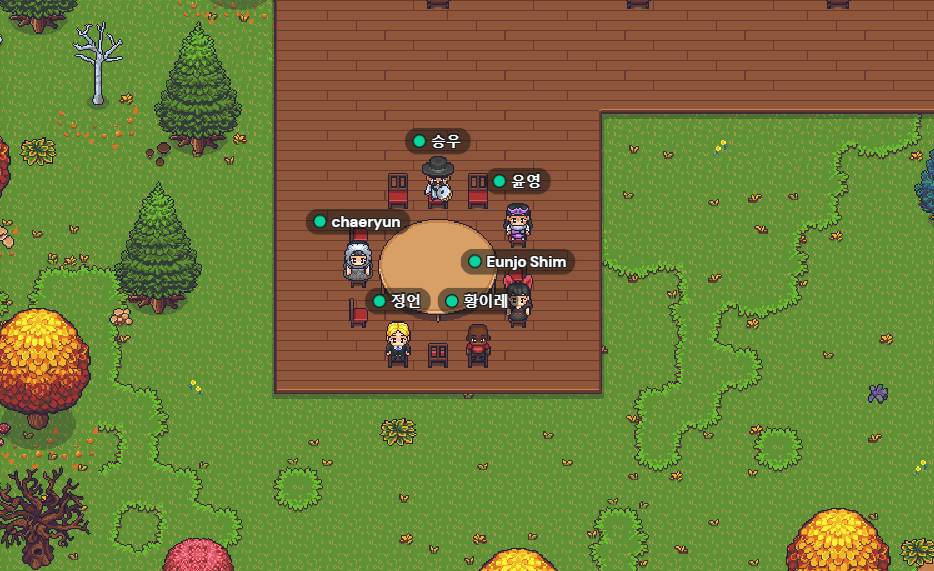
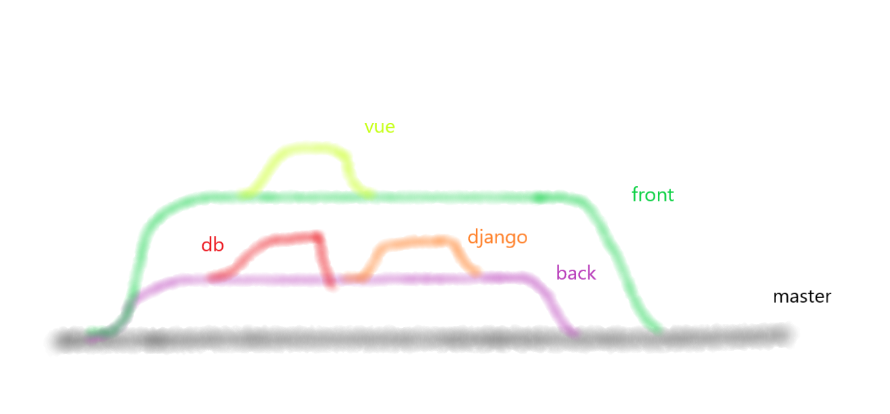
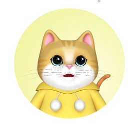

## 목차

1. [**팀 소개**](#1)
2. [**팀원 소개**](#2)
3. [**팀 진행 일정표**](#3)
1. [**기술 세미나 목록**](#4)
   - [Nginx](https://lab.ssafy.com/s06-final/S06P31C201/-/blob/master/TechReport/Seminar/Nginx.md)
   - [UI / UX]()

---

## 🚀 팀 소개

<추천 시스템 고도화>를 통해 영화 추천 서비스를 시작할 예정입니다. 

#### brnach 전략

## 🪐 팀원

<table>
  <tr>
    <td align="center">
      
    </td>
    <td align="center">
      
    </td>
    <td align="center">
      
    </td>
    <td align="center">
      
    </td>
    <td align="center">
      
    </td>
    <td align="center">
      
    </td>
  </tr>
  <tr>
    <td align="center">
      <a href="">
        양승우
      </a>
    </td>
    <td align="center">
      <a href="">
        김채련
      </a>
    </td>
    <td align="center">
      <a href="">
        심은조
      </a>
    </td>
    <td align="center">
      <a href="">
        이정언
      </a>
    </td>
    <td align="center">
      <a href="">
        이윤영
      </a>
    </td>
    <td align="center">
      <a href="">
        황이레
      </a>
    </td>
  </tr>
</table>

---

## 📅 기술 세미나 진행 일정표

### 2022년 4월

| 날짜 (요일) | 발표자 |                          발표 제목                           |
| :---------: | :----: | :----------------------------------------------------------: |
| 04.15 (금)  | 양승우 | [Nginx](https://lab.ssafy.com/s06-final/S06P31C201/-/blob/master/TechReport/Seminar/Nginx.md) |
| 04.25 (월)  | 이윤영 |                         [UI / UX]()                          |

---
