# 📗 Nginx                                                                     22/04/15

​																								  Nginx에 대한 설명이 명쾌하고 이미지까지 잘 되어 있어 가져오게 되었습니다.

​																																									출처 : https://ssdragon.tistory.com/60

## Nginx 란?

 

트래픽이 많은 웹사이트의 서버(WAS)를 도와주는 비동기 이벤트 기반 구조의 웹 서버 프로그램이다.

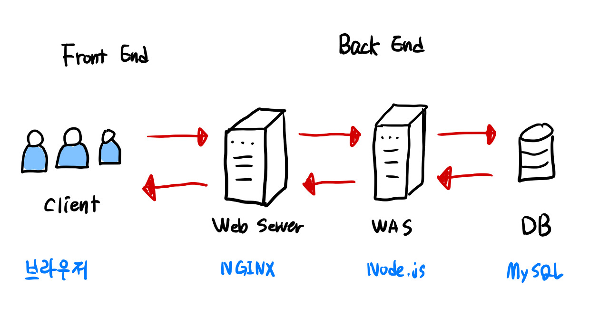

Web Server : 단순히 정적 파일 응답

WAS(Web Application Server) : 클라이언트 요청에 대해 동적 처리가 이뤄진 후 응답

## Nginx가 만들어진 배경

1995년 유닉스 기반으로 만들어진 최초의 웹서버 **NCSA HTTPd**가 있었다. 하지만 버그가 굉장히 많았다.

그래서 만들어진 것이 **아파치 서버(Apache HTTP Server)**이다.

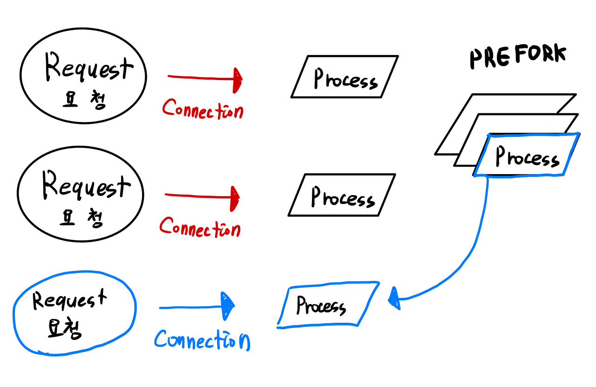

아파치 서버는 요청이 들어오면 커넥션을 형성하기 위해 프로세스를 생성한다. 즉, 새로운 요청이 들어올 때마다 프로세스를 새로 만든다.

(이는 유닉스 계열 OS가 네트워크 커넥션을 형성하는 모델을 그대로 적용한 것이다.)

프로세스를 만드는 것이 시간이 걸리는 작업이다 보니 요청이 들어오기 전에 프로세스를 미리 만들어 놓는 PREFORK 방식을 사용했다.

그래서 새로운 클라이언트 요청이 들어오면 미리 만들어 놓은 프로세스를 가져다 사용했다.

만약 만들어 놓은 프로세스가 모두 할당되면 추가로 프로세스를 만들었다.

이런 구조는 개발하기 쉽다는 장점이 있었다.(확장성)

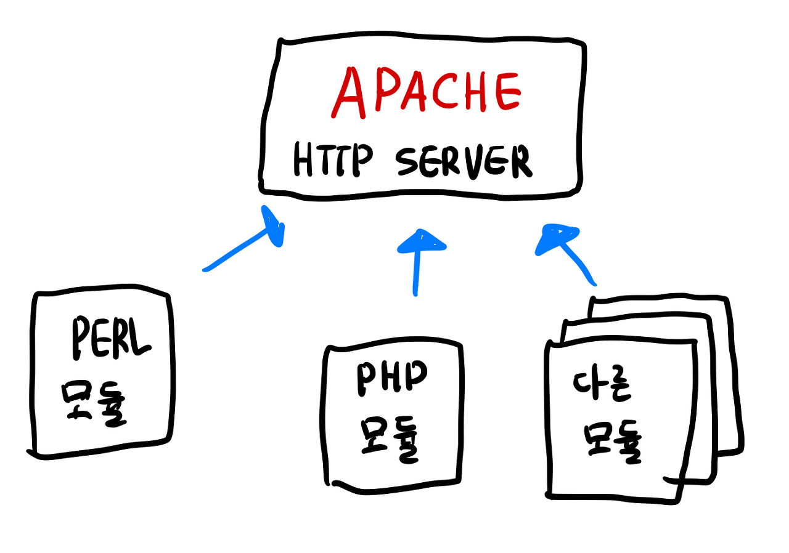

덕분에 개발자는 다양한 모듈을 만들어서 서버에 빠르게 기능을 추가할 수 있었다.

이런 식으로 아파치 서버는 동적 컨텐츠를 처리할 수 있게 되었다.

확장성이 좋다는 장점 덕분에 요청을 받고 응답을 처리하는 과정을 하나의 서버에서 해결하기 좋았다.

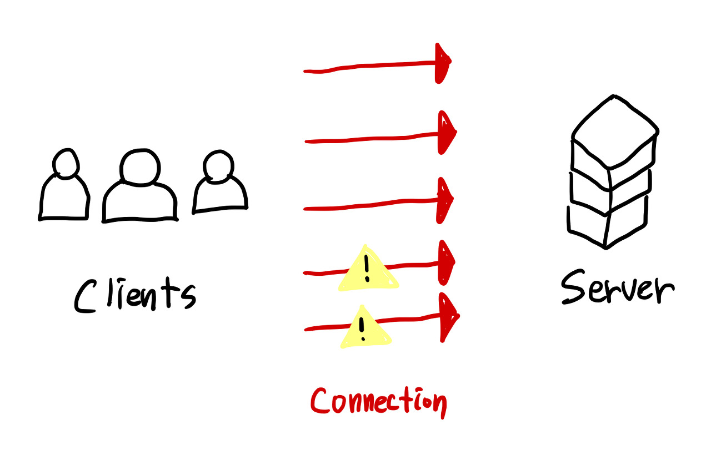

1999년부터는 서버 트래픽량이 높아져서 서버에 동시 연결된 커넥션이 많아졌을 때 더 이상 커넥션을 형성하지 못하는 문제가 생겼다.

이를 **C10K 문제(Connection 10000 Problem)**라고 한다. 

아파치 서버는 다음과 같은 문제점이 있었다.

- 프로세스를 할당하기에 메모리 부족으로 이어짐.
- 확장성이라는 장점이 프로세스의 리소스 양을 늘려서 무거운 프로그램이 되었음
- 많은 커넥션에서 요청이 들어오면 CPU 부하가 높아짐. (컨텍스트 스위칭을 많이함)

즉, 수많은 동시 커넥션을 감당하기엔 아파치 서버의 구조가 적합하지 않았다. 

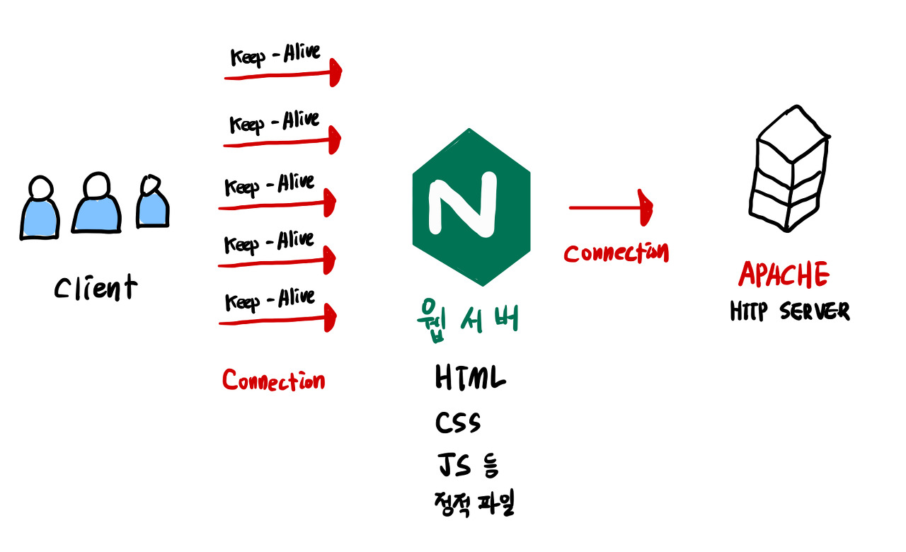

이렇게 시간이 흐르고 2004년에 새로운 구조를 채택하면서 아파치 서버를 보완하기 위한 소프트웨어가 나왔는데 이것이 **NGINX** 이다.

초창기에는 아파치 서버와 Nginx는 함께 사용하기 위해 만들어졌다.

수많은 동시 커넥션을 Nginx가 유지하고, 웹서버이기에 정적 파일에 대한 요청은 스스로 처리하여 아파치 서버의 부하를 줄였다.

웹 서버 역할의 Nginx는 클라이언트로부터 동적 파일 요청을 받았을 때만 뒤에 있는 아파치 서버와 커넥션을 형성했다.

## Nginx의 구조

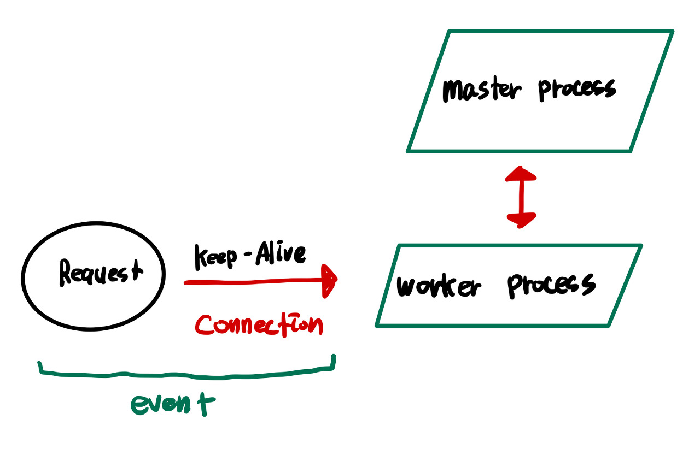

Nginx는 가장 먼저 **마스터 프로세스(master process)**라는 것을 볼 수 있다.

설정 파일을 읽고 **워커 프로세스(worker process)**를 생성하는 프로세스이다.

이 워커 프로세스가 실제로 일을 하는데, 워커 프로세스가 생성될 때 각자 지정된 listen 소켓을 배정받는다.

그 소켓에 새로운 클라이언트 요청이 들어오면 커넥션을 형성하고 처리한다.

**커넥션은 정해진 Keep Alive 시간만큼 유지**되는데, 이렇게 커넥션이 형성되었다고 해서 워커 프로세스가 커넥션 하나만 담당하진 않는다. 형성된 커넥션에 아무런 요청이 없으면 새로운 커넥션을 형성하거나 이미 만들어진 다른 커넥션으로부터 들어온 요청을 처리한다.

Nginx에서는 이런 커넥션 형성과 제거, 새로운 요청을 처리하는 것을 **이벤트(event)**라고 부른다. 

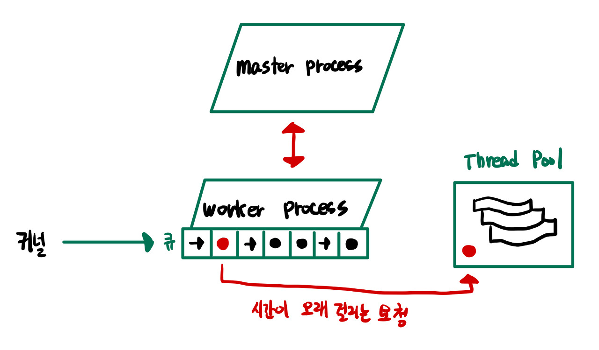

이벤트들은 OS 커널이 큐 형식으로 워커 프로세스에게 전달해준다.

이벤트는 큐에 담긴 상태에서 워커 프로세스가 처리할 때까지 비동기 방식으로 대기한다.

그리고 워커 프로세스는 하나의 스레드로 이벤트를 꺼내서 처리해 나간다.

**아파치 서버는 요청이 없다면 방치되던 프로세스에 비해 서버 자원을 효율적으로 쓰는 것을 알 수 있다.**

 

만약 큐에 담긴 요청중 하나가 시간이 오래 걸린다?

그럴 경우를 대비해서 **스레드 풀(Thread Pool)**을 만들어 그 요청은 따로 수행하게 된다.

워커 프로세스는 처리할 요청이 시간이 오래 걸릴 것 같으면 스레드 풀에 이벤트를 위임하고 다른 이벤트를 처리한다.

 

이런 워커 프로세스는 보통 CPU 코어 수만큼 생성하게 된다.

그래서 코어가 담당하는 프로세스를 바꾸는 횟수를 줄이기에 CPU의 컨텍스트 스위칭을 줄이게 된다.

이게 바로 Nginx가 사용하는 **Event-Driven Model(이벤트 기반 구조)**이다.

## Nginx의 장점과 단점

**단점은 개발자가 직접 모듈을 만들기가 까다롭다.**

**하지만 장점은 다음과 같다.**

프로세스를 적게 만들다보니 가볍다. 이런 프로세스를 적게 만드는 구조는 **Nginx의 설정을 동적으로 바꾸는 것을 가능**하게 한다.

- 동시 커넥션 양 최소 10배 증가 (일반적으로 100 ~ 1000배 증가)
- 동일한 커넥션 수일 때 속도 2배 향상
- 동적 설정 변경

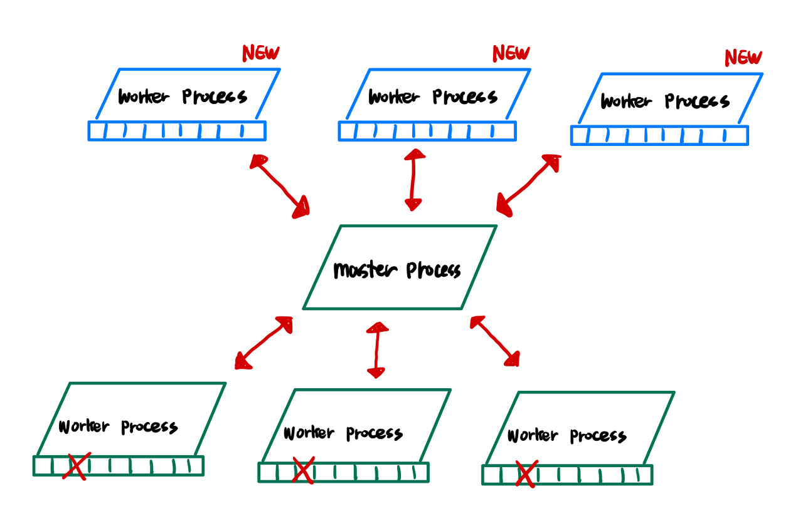

개발자가 설정 파일을 변경하고 Nginx에 적용하면 마스터 프로세스는 거기에 맞게 워커 프로세스를 새로 생성한다.

기존의 워커 프로세스가 더 이상 커넥션을 형성하지 않도록 하여 처리하는 이벤트가 없으면 해당 프로세스를 종료시킨다.

## 이런 동적 설정 변경은 언제 쓰나요?

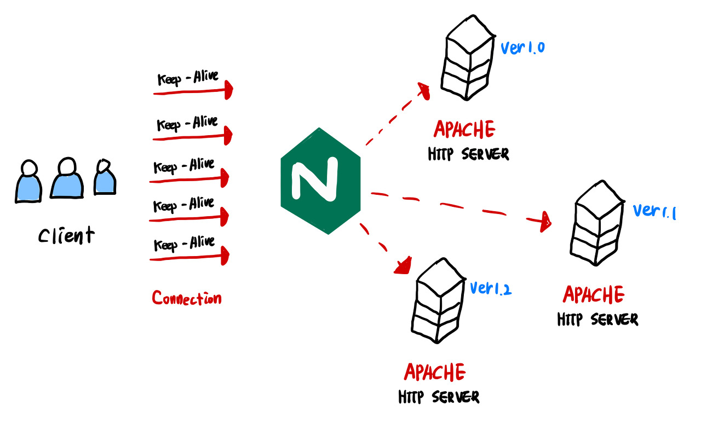

Nginx가 여러 동시 커넥션을 관리하는 도중 뒷단에 서버가 추가되는 상황이 있다.

그 때 **Nginx가 로드 밸런서의 역할을 담당**하게 된다.

**로드 밸런서는 요청을 여러 서버로 분산하는 작업을 수행하게 된다.**

결국 동시 커넥션을 유지하여 기존 요청을 계속 처리하면서 뒷단에 서버를 추가할 수 있는 것이다.

Nginx는 이런 설정 변경을 초당 수십번을 해도 무리없이 커넥션을 관리하고 요청을 서버에 전달하게 된다.

## 성능 테스트 결과

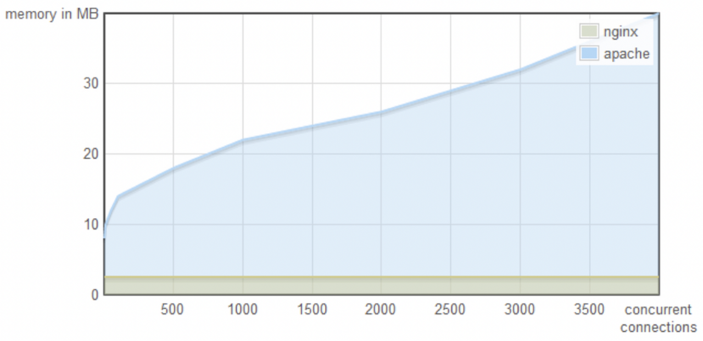

이 지표는 동시 커넥션 수당 메모리 사용률인데 Nginx는 동시 커넥션이 많아져도 메모리 사용률이 낮고 일정하지만

아파치 서버는 많이 사용하고 있다.

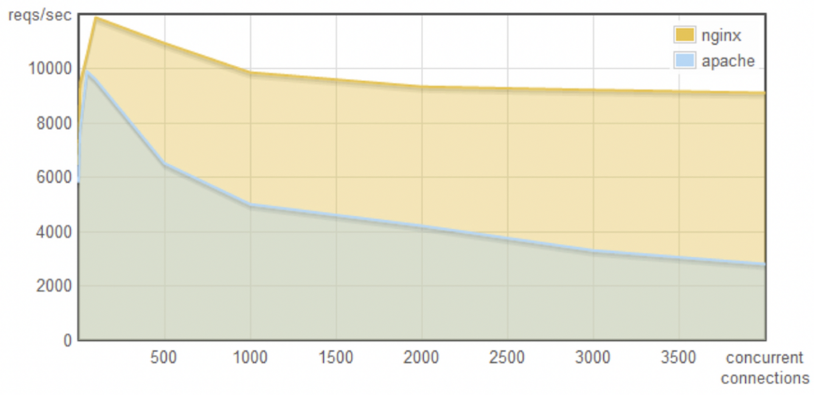

동시 커넥션 수가 많아졌을 때 처리하는 초당 요청 수는 Nginx가 많고 아파치는 낮다. 최소 2배 이상 차이가 난다.

이 지표들은 Nginx가 커넥션 관리를 얼마나 잘하는지 보여준다.

## Apache vs Nginx

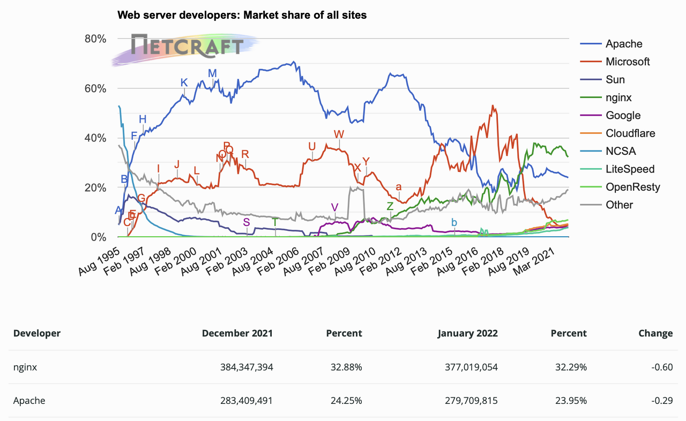

웹서버 1,2위를 다투고 있는데 이는 둘 다 장단점이 있기 때문이다.

22년 1월 nginx 32.88%, apache 24.25% 이다.

#### Apache

- 오랜 기간 업데이트로 다양한 OS에서 안정적
- 모듈을 추가할 수 있는 확장성

#### Nginx

- 웹 서버 보완(C10K 동시 커넥션 문제 해결)
- **성능** (윈도우에서 제대로 된 성능을 내지 못함)

 

 

## NGINX 기능

- 웹 서버
- 로드 밸런서
- 웹 서버 가속기
- SSL 터미네이션 : 클라이언트와 https 통신하고, 서버와 http 통신하는 것
- 캐싱 : http 프로토콜을 사용하여 전달하는 콘텐츠를 캐싱할 수 있음, 한 번 서버에서 응답받은 것을 스스로 보관하고 클라이언트에 전달함.
- HSTS(HTTP Strict Transport Security)
- CORS 처리
- TCP/UDP 커넥션 부하 분산
- HTTP/2 등

---