# 📙 UI / UX (2022/04/25)


> UI/ UX 디자인 왜 중요할까? 

	- 프론트엔드 개발자는 디자이너와 소통하며 그들을 이해하고, 때론 스스로 제품과 서비스의 사용성을 개선하기 위해 UI에 대해 잘 이해하고 숙지해야 한다. 


| 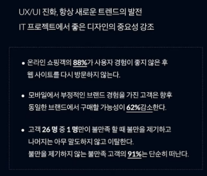 | 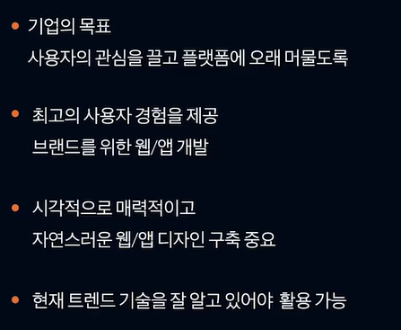 |
| :----------------------------------------------------------: | :----------------------------------------------------------: |


## UI / UX 예시 - 카카오톡

| <br /> |  |
| :----------------------------------------------------------: | :----------------------------------------------------------: |


### 🖥 UI : User Interface의 약자로, 	

- 정보기기나 소프트웨어의 화면 등, 사람과 접하는 면 / 사람과 시스템의 접점 및 채널
- 사용자가 제품 혹은 서비스를 이용할 때 보게되는 화면
- 사용자가 서비스를 이용하기 위해서 만들어졌다.
- 폰트, 레이아웃 등 사용자가 마주하게 될 시간적인 디자인이다.
- 누구에게나 아름답고 유용한 소프트웨어 즉, 보편성 지향 - 보편적 인간을 모델로 분석
- 제품이 주는 기능적이고 기술적인 특징을 인간적인 사용자 가치로 변화시켜 주는 매개체


| 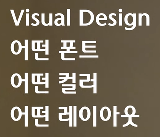 | 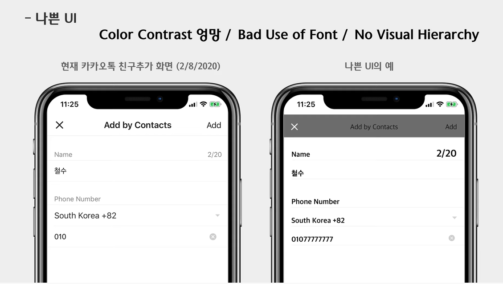 |
| :----------------------------------------------------------: | :----------------------------------------------------------: |


### ✨ UX : User Experience의 약자로, 

- 사용자 경험 즉, 소프트웨어를 사용하는 사용자의 느낌, 태도, 행동
- 사용자가 제품과 서비스, 회사와 상호작용을 하면서 가지게 되는 전체적인 느낌이나 경험

- 특정한 사람만 만족시키는 주관성 지향 - 특정 사용자를 모델로 공감
- UX의 대상이 사용자의 만족이나 감정 등의 시멘틱(semantic) 측면에 초점이 맞추어져 있다 보니 그 영역도 광범위하다. UX의 대상은 인터랙션 디자인(Interaction Design), 사용성(Usability), 정보 구조(Information Architecture), 인간공학(Human Factors Engineering) 등으로 여러 분야를 포괄
- UX 디자인이란 사용자가 만족할 수 있도록 사용자 중심적으로 설계된 디자인이다.


| 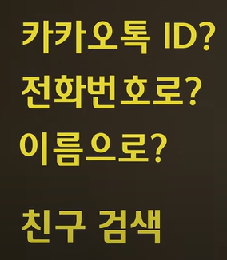 | 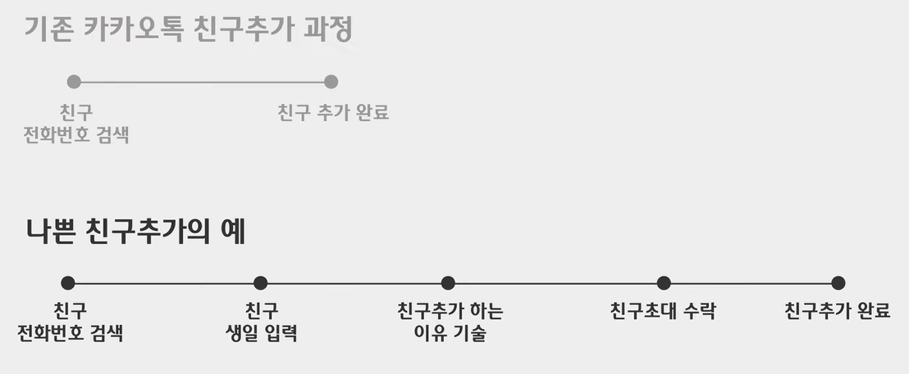 |
| :----------------------------------------------------------: | :----------------------------------------------------------: |


## UI와 UX 연결성

```
누구를 위해 어떤 경험을 디자인 하는가!에 따라서 굉장히 달라진다. 
```


## 프론트엔드 개발자가 알아야할 UI요소

- 유저 인터페이스(UI)는 우리가 앱과 웹사이트를 만들때 사용하는 요소 중 하나이다.
- UI는 버튼, 스크롤바, 메뉴, 체크박스 등 맥락에 맞는 요소를 사용하여 사용자와 화면 간의 상호 작용을 더함으로써 사용자가 더 쉽고 직관적으로 인터페이스를 이용할 수 있도록 돕는다.

- UI 요소를 사용하여 제품의 시각적 일관성을 유지함으로써 유저가 고민하지 않고도 쉽게 당신의 제품을 사용할 수 있도록 돕는 유저-친화적인 인터페이스를 만들 수 있게 된다.


## 유저 인터페이스의 요소들

유저 인터페이스 네가지 분류

> 1. Input Controls
>
> 2. Navigation Components
>
> 3. Informational Components
>
> 4. Containers


- **Input Controls**은 유저가 시스템에 정보를 입력할 수 있도록 한다. 회원 가입, 프로필 관리 등에 사용되는 UI 요소들이 여기에 해당

| 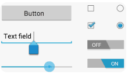 | 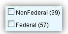 |
| :----------------------------------------------------------: | :----------------------------------------------------------: |


- **Navigational Components**는 유저가 제품 또는 웹사이트에서의 이동을 안내하여 돕는다. iOS의 탭 바나 안드로이드의 햄버거 메뉴 등

| 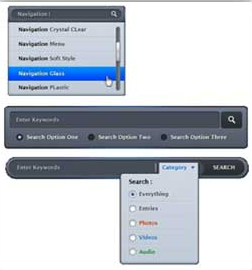 | 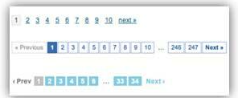 |
| :----------------------------------------------------------: | :----------------------------------------------------------: |


- **Informational Components**는 유저에게 정보를 제공

| 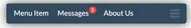 | 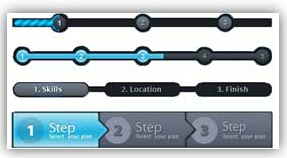 |
| :----------------------------------------------------------: | :----------------------------------------------------------: |


- **Containers**는 관련된 컨텐츠들을 함께 묶어놓는 역할


### 1. 아코디언 (Accordion)

- 유저가 각 섹션을 펼쳐서 컨텐츠를 확인하고, 필요하지 않으면 축소할 수 있는 인터페이스

- 많은 양의 정보를 한정된 공간에 담을때 사용


### 2. 벤토 메뉴 (Bento Menu)

- 통칭 벤토(도시락) 메뉴 또는 벤토 박스라고 불리는 이것은 그리드 목록으로 나열되는 메뉴를 의미
- 형태와 용처에 따라 벤토, 햄버거, 케밥, 미트볼 등으로 분류되는데, UI 디자이너들이 음식 이름 붙이는 것을 사랑하기 때문


### 3. 브레드크럼 (Breadcrumb)

- 브레드크럼이라고 불리는 UI 요소는 유저가 사이트 구조상 어디에 위치하고 있는지 알려준다.

- 헨젤과 그레텔에서 길을 잃지 않기 위해 빵 부스러기를 길에 흘려놓은 것에서 명칭이 유래된 것 같다고 추측..

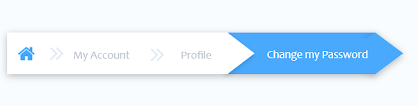

### 4. 캐러셀 (Carousel)

- 캐러셀은 이미지나 카드와 같은 컨텐츠를 쉽게 탐색할 수 있도록 한다.

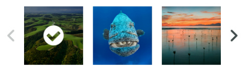


### 5. 도너 메뉴 (Döner Menu)

- 도너 메뉴는 잘 알려진 햄버거 메뉴(Hamburger Menu)의 바리에이션
- 햄버거 메뉴가 같은 길이의 선들이 쌓여진 형태이라면, 도너 메뉴는 다른 길이의 선이 쌓인 형태
- 주로 아래로 갈수록 선이 짧아지는 형태로 활용

- 이 UI의 형태는 목록이나 그룹의 필터링을 은유(밑으로 내려갈수록 걸러지는 체를 표현한 것 같다)

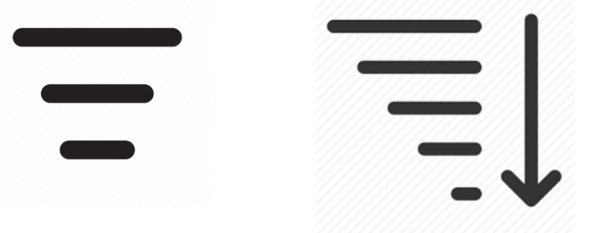

### 6. 드롭다운 (Dropdown)


### 7. 피드 (Feed)

- 피드는 사용자의 활동을 시간순으로 표시
- 내용은 다양하며 단순한 텍스트에서 이미지, 비디오에 이르기까지 여러가지 종류로 표현 ex) 트위터


### 8. 햄버거 메뉴 (Hamberger Menu)

- 이 세 개의 작은 선들이 마치 햄버거를 쌓아놓은 것 같아 햄버거 메뉴라고 불리며, 
- 목록 메뉴를 의미하는 잘 알려진 UI 요소
- 앱의 왼쪽 상단 모서리에 흔히 사용되며 일반적으로 메뉴, 탐색 링크가 포함

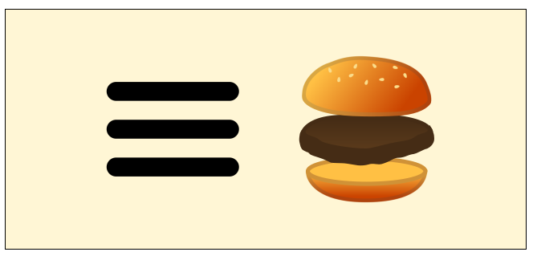


### 9. 케밥 메뉴 (Kebab Menu)

- 케밥 메뉴는 점들이 세로로 정렬되어 있는데, 주로 설정 옵션등을 담는데 사용


### 10. 미트볼 메뉴 (Meatballs Menu)

- 미트볼 UI는 세 개의 수평으로 나열된 점으로 표현
- 미트볼 메뉴를 클릭하면 더 많은 옵션을 볼 수 있음을 의미


### 11. 모달(Modal)

- 모달은 사용자와 상호작용하거나 특정 정보를 제공하기 위해 컨텐츠나 메세지를 담고있는 작은 박스를 추가적인 레이어로 띄우는 것


### 12. 뱃지(Badge)

- 오늘날 인터페이스의 모든 곳에서 알림을 나타내는 작은 빨간 점
- 알림 UI
- 우리가 확인해야 할 새로운 것이 있음을 알려주는 역할

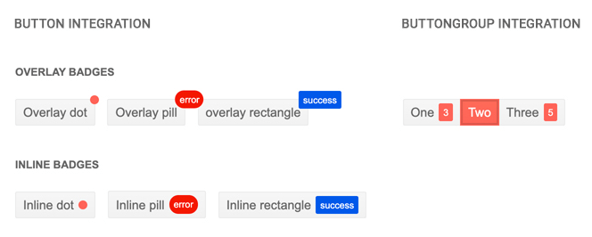


### 13. 픽커 (Picker)

- 날짜와 시간을 선택할 때 자주 볼 수 있는 UI

- 일관성 있는 형식으로 쉽게 정보를 관리하고 액세스 할 수 있다.


### 14. 라디오 버튼 (Radio Buttons)

- 종종 체크박스와 함께 사용
- 작은 원으로 표현되어 리스트 중 하나의 옵션을 선택할 때 많이 사용
- 체크박스가 복수의 옵션을 선택할 수 있는데 반해 라디오 버튼은 하나만 선택해야 하는 옵션에 주로 사용

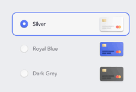


### 15. 스텝퍼 (Stepper)

- 유저가 두 개의 요소를 사용하여 사용자가 값을 조절할 수 있게 한다. (주로 증가, 감소)

- 미리 설정된 증가(또는 감소) 값으로만 값을 변경

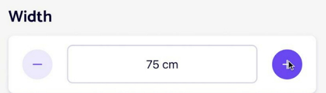


### 16. 탭 바 (Tab Bar)

- 탭 바는 모바일 앱의 아래에서 쉽게 찾아볼 수 있으며 유저가 각 주요 섹션으로 빠르게 이동할 수 있도록 도와준다.


### 17. 툴팁 (Tooltip)

- 유저에게 인터페이스를 이해할 수 있게 도와주는 작은 힌트를 제공

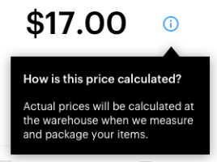


### 18. 토글 (Toggle)

- 켜고 끌 수 있는 스위치를 의미
- 무언가 켜거나 끄고, 보이게 하거나 보이지 않게 하는 양자 택일 스위치


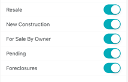


그 외, 버튼, 체크박스, 카드, 코멘트, 폼, 아이콘, 인풋필드, 로더, 페이지네이션, 프로그레스 바, 사이드 바, 슬라이더 컨트롤, 서치 필드, 태그, 


| 안드로이드 디자인 가이드<br />[바로가기](https://developer.android.com/design/?hl=ko)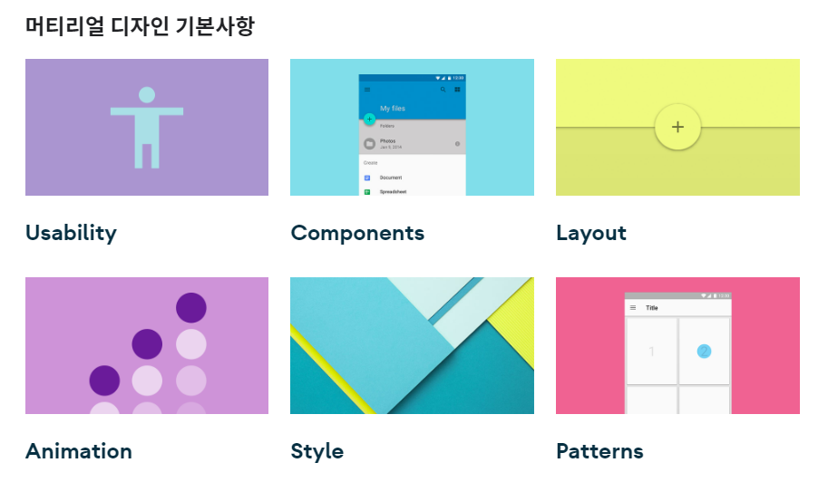 | IOS 디자인 가이드<br />[바로가기](https://developer.apple.com/design/human-interface-guidelines/ios/overview/themes/)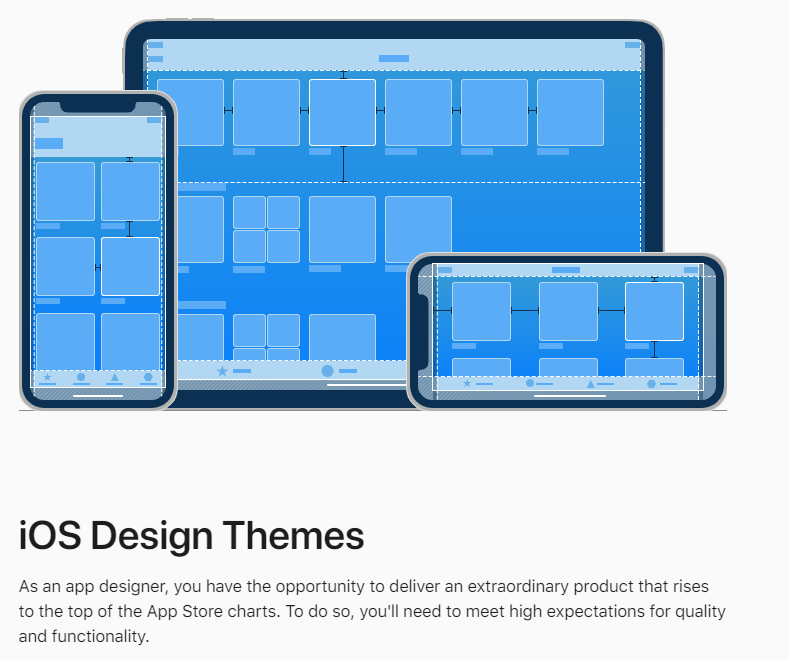 |
| ------------------------------------------------------------ | ------------------------------------------------------------ |


## 📝TMI로.. HIG 설명

- Human Interface Guidelines 
- Apple에서 제공하는 Apple 플랫폼에서의 application에 대한 가이드라인
- 매년 업데이트 되서 IOS개발자라면 매년 꼭 숙지해야 된다고 한다.
- 공통된 약속 즉, 표준을 제공
- 애플리케이션 개발자에게 일련의 권장 사항을 제공하는 소프트웨어 개발 문서
- 플랫폼 회사들은 문서를 굉장히 중요시한다. 1대1로 개발자들에게 다 얘기할 수 없기 때문
- 제대로 안지키면 거부 당한다는...! (App store review Guidelines - 하지만 HIG가 최우선 되는 문서!)
  - reject 이유 : 앱의 불안정 40%, ,,,


# 🎃 UI/ UX 디자인 트랜드


> 최근 트랜드

| 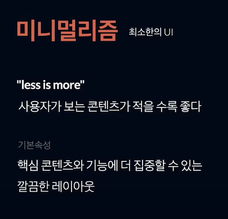 | 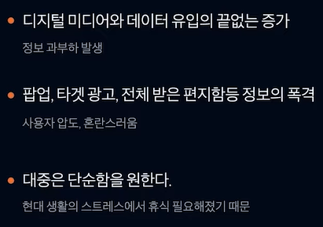 |
| :----------------------------------------------------------: | :----------------------------------------------------------: |
| 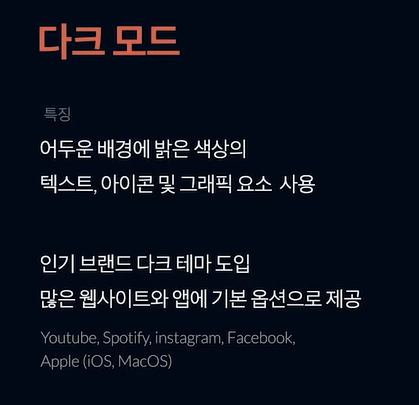 | 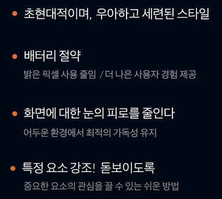 |
| 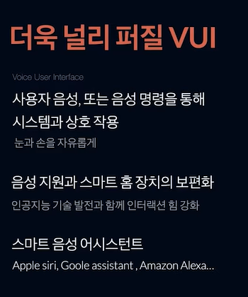 | 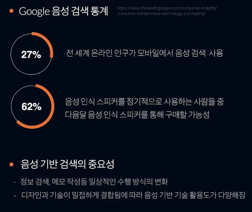 |


| 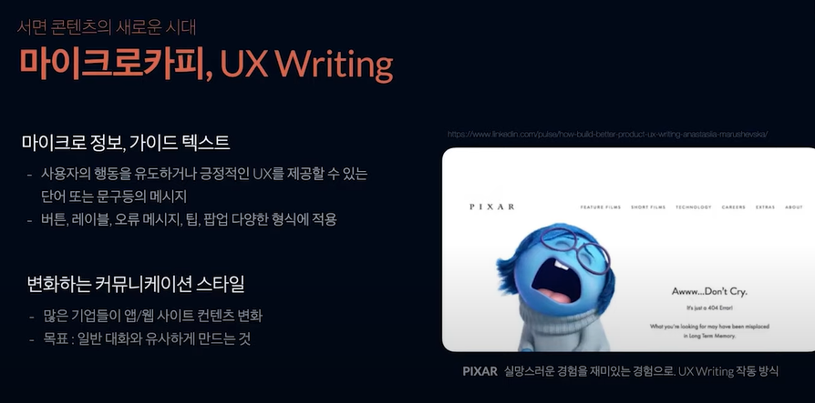 | 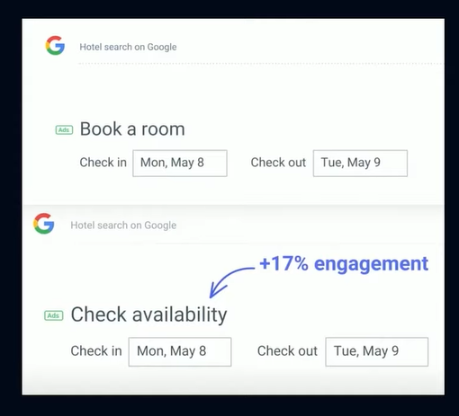 |
| :----------------------------------------------------------: | ------------------------------------------------------------ |

- 좋은 마이크로카피는 사용자 흐름 전반에 걸쳐 사람들이 경험하는 질문과 불안은 예측하고 우려를 완화하기 위한 중요한 정보를 제공한다. 


| 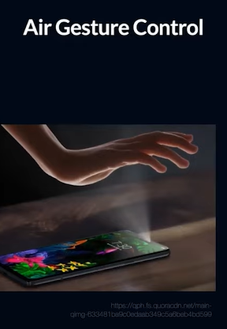 | 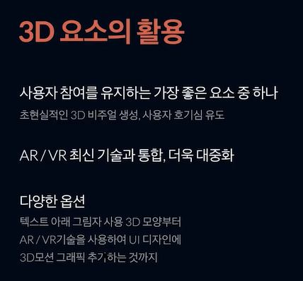 | 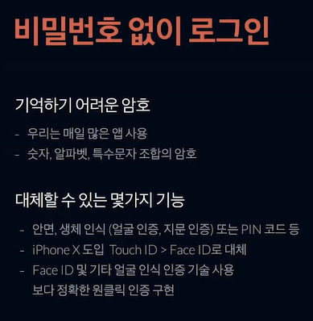 |
| :----------------------------------------------------------: | :----------------------------------------------------------: | :----------------------------------------------------------: |
| 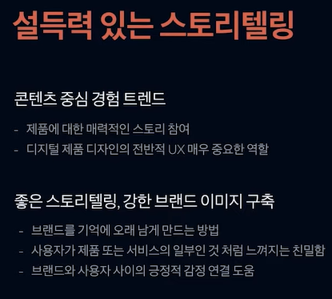 | 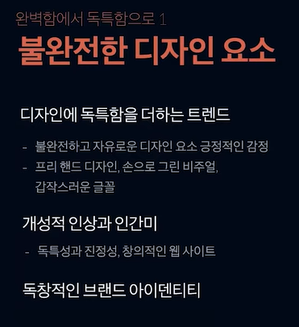 |  |


| 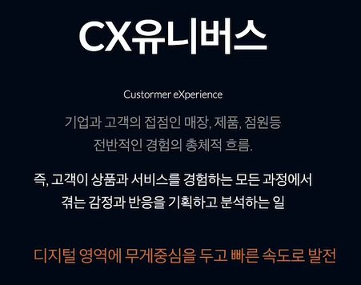 | 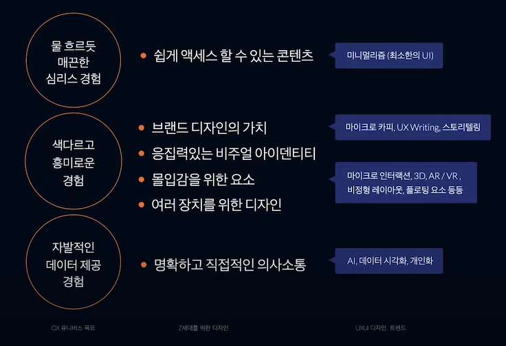 |
| :----------------------------------------------------------: | :----------------------------------------------------------: |


|  |  |
| :----------------------------------------------------------: | :----------------------------------------------------------: |


### 🎨 우리 프로젝트에 적용해 볼 수 있을 것 같은 디자인 트렌드 

- 미니멀리즘 / 다크모드 / 마이크로카피 / 마이크로인터렉션 / 물흐르듯 매끈한 심리스 경험 / 자발적인 데이터 제공 경험

---

- 미니멀리즘

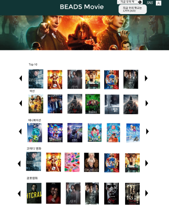


- 물흐르듯 매끈한 심리스 경험 (비슷한 추천영화 타고타고 가기~)

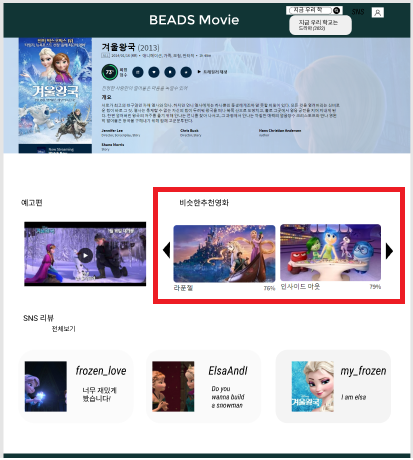


- 자발적인 데이터 제공 경험 및 마이크로 인터렉션 (좋아요 표시)

|  | 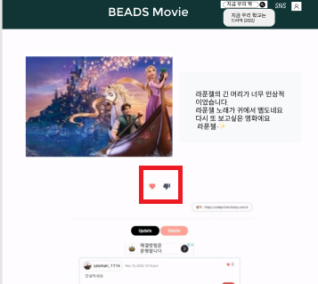 |
| :----------------------------------------------------------: | :----------------------------------------------------------: |


- 마이크로카피 (에러페이지 혹은 로그인 오류 회원가입 오류 모달창에 적용 가능 )

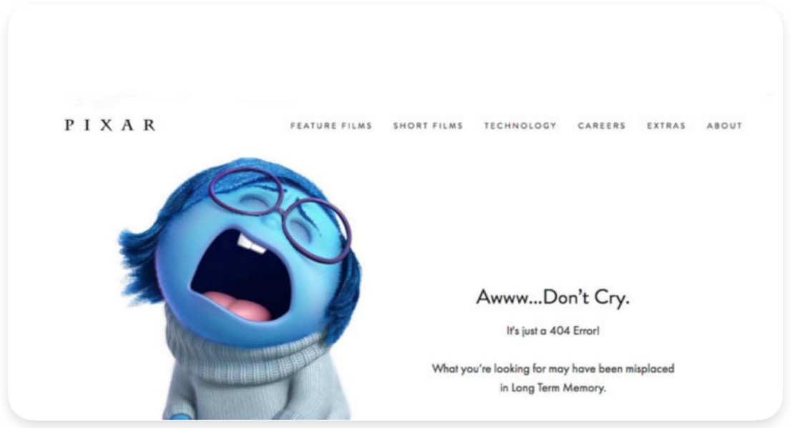


출처 : [UI 블로그](https://velog.io/@oneook/%ED%94%84%EB%A1%A0%ED%8A%B8%EC%97%94%EB%93%9C-%EA%B0%9C%EB%B0%9C%EC%9E%90%EB%9D%BC%EB%A9%B4-%EB%B0%98%EB%93%9C%EC%8B%9C-%EC%95%8C%EC%95%84%EB%91%90%EC%96%B4%EC%95%BC-%ED%95%A0-32%EA%B0%80%EC%A7%80%EC%9D%98-UI-%EC%9A%94%EC%86%8C-%EB%B2%88%EC%97%AD),  [MARIA 블로그](https://careerfoundry.com/en/blog/ui-design/ui-element-glossary/), [UX 블로그](https://story.pxd.co.kr/567), [UX/UI디자인 트렌드 유튜브](https://youtu.be/Y1a-X-P6n7Y), [네이버 지식백과](https://terms.naver.com/entry.naver?docId=1691521&cid=42171&categoryId=42190), [HIG 블로그](https://blog.naver.com/neuwineskin/222571739619) , [UI 요소 사진](https://www.usability.gov/how-to-and-tools/methods/user-interface-elements.html), [HIG 유튜브](https://youtu.be/vH-W6dN1ZOs), [UI/UX 유튜브](https://youtu.be/fMunhPQPZA4) 